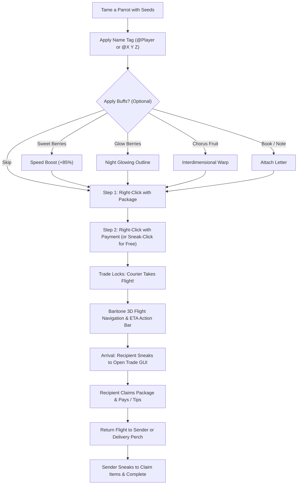

# 📖 ParrotCouriers — Player & Gameplay Manual

---

## 🛠️ Step-by-Step Courier Setup Workflow

---

## 🍇 Courier Buffs & Attachments

Buffs must be applied during the setup phase (before finalizing Step 2):

| Item | Interaction | Effect |
|---|---|---|
| **Sweet Berries** | Sneak + Right-Click | Grants a **+85% speed increase** and displays cloud particle trails. |
| **Glow Berries** | Sneak + Right-Click | Gives the parrot a **glowing outline** for night flights and cave navigation. |
| **Chorus Fruit** | Sneak + Right-Click | Unlocks **cross-dimensional flight** (ascends and creates a portal warp between Overworld, Nether, and End). |
| **Book & Quill / Written Book** | Right-Click | Attaches a delivery letter. The recipient can click the letter slot inside the trade GUI to open and read the book directly on screen. |

---

## 📬 Delivery Perches (Mailbox System)

A **Delivery Perch** acts as a personal mailbox where couriers will land instead of chasing moving players.

### How to use:
1. Stand on top of the block you want to designate as your perch (e.g. a decorative fence post, gold block, or mailbox structure).
2. Type `/courier perch set` to save that location.
3. Type `/courier perch prioritize` to toggle whether deliveries and returning couriers land at your perch or follow your player directly.
4. If you relocate, type `/courier perch remove` or `/courier perch set` again.

---

## 🧭 Live Action Bar & Tracking

- When a courier is en route, both sender and recipient receive clean Action Bar updates every second showing:
  - **For Sender:** `[Courier] Delivering to PlayerName • ETA: 12s`
  - **When Returning:** `[Courier] Returning to you • ETA: 8s`
  - **For Recipient:** `[Courier] Incoming delivery from PlayerName • ETA: 12s`
- When the courier lands, action bar and chime sounds alert players: `[Delivery Ready] Sneak to trade`.

---

## 🔄 Recalling & Rescuing Couriers

If you want to recall an active delivery at any time:
- Type `/courier recall`.
- If the courier is en route, it immediately turns around and flies back to you with your package.
- If the courier is trapped in distant unloaded chunks, `/courier recall` awakens the chunk and recovers your parrot and package back to your side instantly with its exact feather color preserved.
